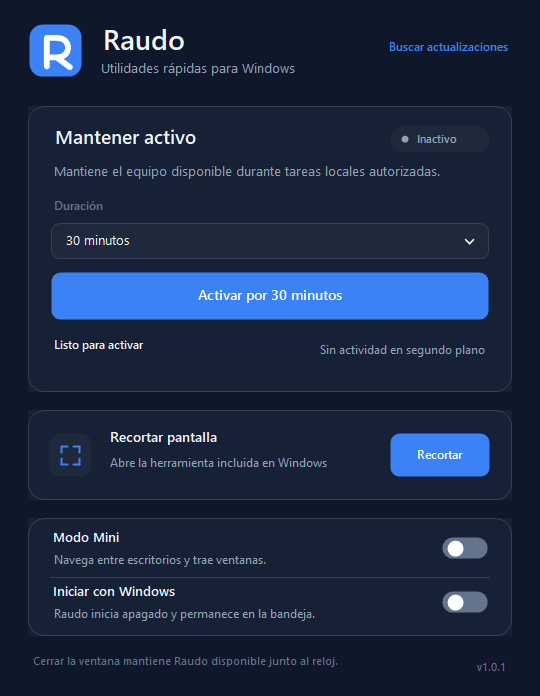
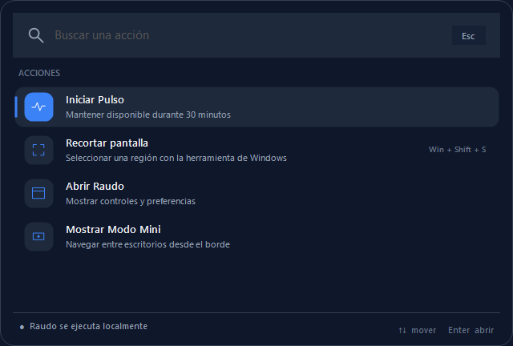
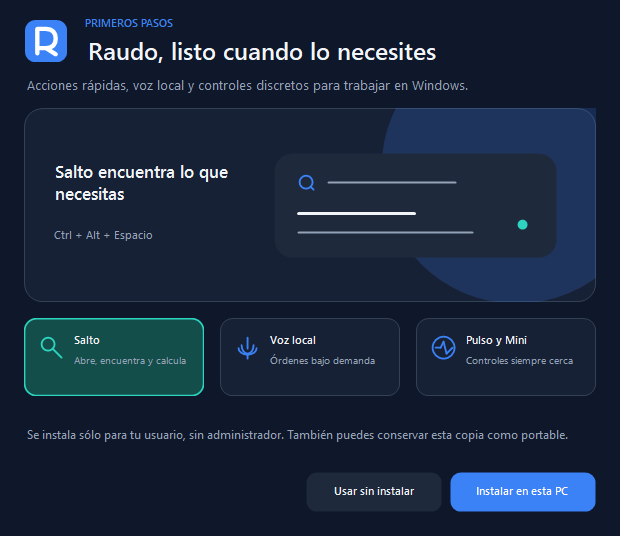

<p align="center">
  
</p>

# Raudo

Raudo reúne utilidades locales y ligeras para Windows en una aplicación de bandeja. Está diseñado para permanecer disponible sin mantener trabajo innecesario en segundo plano.

[](https://github.com/adrielcrv/raudo-windows/actions/workflows/build.yml)
[](https://github.com/adrielcrv/raudo-windows/actions/workflows/codeql.yml)

<p align="center">
  
</p>

## Instalar

1. Descarga [Raudo para Windows](https://github.com/adrielcrv/raudo-windows/releases/latest/download/Raudo-win.exe).
2. Abre el archivo descargado.
3. Selecciona **Instalar en esta PC** en la bienvenida.

Raudo se instala únicamente para el usuario actual, crea un acceso en el menú
Inicio y no solicita permisos de administrador. El mismo ejecutable puede usarse
sin instalar; el [ZIP portable](https://github.com/adrielcrv/raudo-windows/releases/latest)
continúa disponible en cada publicación.

Consulta [Instalación y automatización](docs/INSTALL.md) para verificar la suma
SHA-256 o realizar una instalación no interactiva.

## Funciones

La ventana principal adapta composición, controles e iconos al cambiar entre
monitores con escalas distintas, incluido 200%. Si el área de trabajo es menor
que el contenido, conserva el acceso mediante desplazamiento vertical.

### Pulso

- Evita temporalmente que el sistema y la pantalla entren en reposo.
- Genera una entrada mínima únicamente después de 45 segundos sin actividad.
- Restaura el cursor a su posición original.
- Se limita a 15, 30, 60 o 120 minutos.
- Conserva su vencimiento original al reiniciar Raudo o completar una actualización.
- Se detiene al bloquear, suspender o cerrar la sesión interactiva de Windows.
- No inicia una sesión nueva automáticamente; sólo recupera una sesión vigente con su vencimiento original.

### Salto

- Abre un lanzador local con `Ctrl + Alt + Espacio` o desde la bandeja.
- Busca ventanas, aplicaciones, carpetas conocidas y acciones sin distinguir mayúsculas ni acentos.
- Prioriza una ventana abierta antes de iniciar otra instancia de la misma aplicación.
- Indica si una ventana está en este u otro escritorio y permite enfocarla o traerla.
- Obtiene las aplicaciones del catálogo de Windows una sola vez por sesión y bajo demanda.
- Calcula expresiones aritméticas y convierte unidades comunes localmente.
- Adapta su tamaño al contenido: se recoge para un cálculo o resultado específico y crece hasta cinco filas para una búsqueda amplia.
- Conserva resultados adicionales mediante rueda, teclado y un indicador de desplazamiento discreto.
- Puede moverse desde el agarre inferior, volver a centrarse con doble clic y alternar entre tres niveles de opacidad con `Ctrl + Shift + O`.
- Muestra preparación únicamente mientras Windows entrega por primera vez el catálogo de aplicaciones; los cálculos y filtros locales no esperan ni muestran carga.
- Abre carpetas conocidas de Windows sólo cuando resuelven a una ubicación local existente.
- Copia un cálculo o conversión únicamente después de seleccionarlo.
- Al escribir `portapapeles` o `clipboard`, consulta bajo demanda hasta cinco textos del historial administrado por Windows; puede añadirse un filtro después del comando.
- Si el historial está desactivado, Salto ofrece abrir directamente `Configuración > Sistema > Portapapeles` para que el usuario decida habilitarlo.
- Libera esos textos al cambiar de consulta o cerrar Salto y no mantiene un listener ni un historial propio.
- Controla reproducción, cambio de pista, silencio y volumen mediante las teclas multimedia de Windows.
- Permite iniciar o detener Pulso, abrir Recortes y Raudo, controlar Modo Mini y cambiar entre escritorios disponibles.
- Se opera con flechas, `Enter`, `Escape` o un clic.
- Se crea únicamente al primer uso: no mantiene historial, no indexa archivos, no ejecuta scripts ni instala procesos auxiliares.

<p align="center">
  
</p>

### Voz

- Escucha una orden al presionar `Ctrl + Alt + V` o seleccionar **Hablar con Raudo**; no mantiene un micrófono abierto ni una palabra de activación en segundo plano.
- Utiliza el reconocimiento de gramática de Windows con un catálogo local y cerrado de órdenes en español.
- Puede abrir aplicaciones instaladas, Salto, Raudo, YouTube o una búsqueda del clima; controlar Pulso, multimedia y volumen; recortar pantalla; crear o cambiar escritorios; calcular y convertir unidades.
- Reconoce alias localizados de aplicaciones, por ejemplo **Bloc de notas**, aunque Windows exponga el nombre instalado en otro idioma.
- Si una orden no se entiende o no coincide con una acción segura, vuelve a escuchar una vez en la misma sesión.
- Requiere un idioma de voz en español instalado en Windows y permiso de micrófono para aplicaciones de escritorio.
- El audio y el texto reconocido son transitorios: Raudo no los almacena, no conserva historial y no los envía a un servicio remoto.

### Multimedia

- Ofrece reproducir o pausar, pista anterior, pista siguiente, silenciar, bajar volumen y subir volumen.
- Está disponible directamente en Modo Mini, al buscar en Salto o desde el submenú **Multimedia** de la bandeja.
- Envía un comando multimedia estándar a Windows; la aplicación que responde a las teclas multimedia decide cómo aplicarlo.
- Desde las opciones de Mini puede elegir entre las sesiones que Windows expone y volver al control automático.
- La selección consulta únicamente el nombre de la aplicación y su estado de reproducción; no inspecciona pestañas, títulos, contenido, progreso ni carátulas.

### Recortar pantalla

Abre la Herramienta Recortes mediante el protocolo `ms-screenclip` incluido en Windows. Esta acción no captura ni lee el contenido del portapapeles.

### Escritorios de trabajo

- Permite crear un escritorio desde la ventana principal, la bandeja o una orden de voz.
- Incluye una guía breve para personas que aún no utilizan los escritorios virtuales de Windows.
- Mantiene Salto, la escucha de voz y sus confirmaciones en el escritorio activo.
- Oculta las direcciones de navegación que no tienen un escritorio adyacente.

### Modo Mini

- Se recoge como un control de borde compacto que permanece visible sin invadir el contenido.
- Se revela y se recoge con una transición breve que respeta la preferencia de animaciones de Windows.
- Al minimizar la ventana principal, una transición conectada confirma visualmente su llegada a Mini.
- Ofrece pista anterior, reproducción o pausa y pista siguiente con un clic, sin escribir una búsqueda.
- Mantiene los controles de escritorio en los extremos y omite direcciones o pistas que no están disponibles.
- Reúne selección de reproductor, volumen, ventanas y opciones adicionales en un menú secundario.
- Sigue automáticamente al escritorio activo y permanece siempre encima.
- Reduce su presencia durante pantalla completa y presentaciones, sin perder el área de interacción.
- Muestra únicamente las direcciones de escritorio que están disponibles.
- Consulta las ventanas de otros escritorios únicamente al abrir el selector.
- Permite traer una ventana elegida al escritorio actual sin cerrarla.
- Recuerda el borde y la altura elegidos; puede ocultarse desde la propia pestaña o la bandeja.
- Conserva monitor, borde y altura relativa cuando cambia la escala, resolución o área de trabajo, y permanece visible si una pantalla se desconecta.
- Indica el estado de la sesión sin alterar el azul de marca y recuerda los umbrales de 15 y 5 minutos.

<p align="center">
  
</p>

Raudo solicita a Windows que muestre únicamente su pestaña Mini en todos los escritorios. No modifica la configuración global de Vista de tareas. Si una versión de Windows no permite el anclaje automático, Raudo conserva como alternativa la configuración manual mediante `Win + Tab`.

La detección de ventanas utiliza la interfaz pública `IVirtualDesktopManager`. El seguimiento de la pestaña, los límites de navegación y el movimiento de ventanas entre procesos emplean una capa de compatibilidad limitada por versión; esas funciones se desactivan de forma segura si una actualización de Windows cambia el contrato interno. Raudo no instala controladores, servicios ni procesos auxiliares.

## Privacidad y red

Raudo no incluye telemetría, cuentas ni publicidad. Las búsquedas de Salto permanecen en memoria y se utilizan únicamente para filtrar resultados o producir un cálculo o conversión local; sólo se guardan la posición y el nivel de opacidad elegidos. El catálogo de aplicaciones se consulta a Windows bajo demanda; Raudo no recorre el disco ni conserva las consultas. Un resultado sólo se escribe en el portapapeles después de seleccionarlo. La consulta `portapapeles` lee explícitamente hasta cinco textos del historial administrado por Windows, los limita en memoria y los libera al salir de ese modo; no registra cambios ni crea un historial paralelo. Las órdenes de voz utilizan una gramática local y sólo existen durante la sesión de escucha iniciada por el usuario. Los controles multimedia automáticos envían comandos fijos; al abrir el selector de Mini, Raudo consulta localmente las sesiones que Windows expone y conserva de forma transitoria el nombre de la aplicación y su estado. Raudo sólo se conecta directamente a Internet cuando el usuario selecciona **Buscar actualizaciones**. Las acciones de YouTube o clima abren el navegador predeterminado, que administra su propia conexión. En una instalación local, Raudo puede descargar el paquete oficial después de una confirmación, validar su versión y sus sumas SHA-256, reemplazar el ejecutable de forma atómica y reiniciarse. Una copia portable abre la publicación para actualización manual.

Consulta [PRIVACY.md](PRIVACY.md) para conocer los datos locales y el comportamiento de red.

## Bienvenida y novedades

Raudo muestra una guía breve la primera vez que se abre y después de instalar una
versión con funciones nuevas. La guía presenta los accesos esenciales, respeta la
preferencia de animaciones de Windows y no mantiene trabajo en segundo plano al
cerrarse. Puede abrirse nuevamente desde **Bienvenida y novedades** en el menú del
icono junto al reloj.

<p align="center">
  
</p>

## Requisitos

- Windows 11 en una versión con soporte vigente.
- Windows 10 22H2 x64 es técnicamente compatible, aunque su soporte general terminó en octubre de 2025.
- .NET Framework 4.8.
- No requiere permisos de administrador.

Windows 7, Windows 8 y Windows 8.1 no forman parte del alcance compatible.

## Desarrollo

Compilar y ejecutar las pruebas unitarias:

```powershell
.\scripts\Build.ps1 -Test
```

Ejecutar también las pruebas de integración con las API de Windows:

```powershell
.\scripts\Build.ps1 -Test -IntegrationTest
```

Validar manualmente el movimiento entre dos escritorios virtuales:

```powershell
.\scripts\Build.ps1 -Test
.\artifacts\Raudo.Tests.exe --desktop-integration
```

Generar el ZIP portable y sus hashes:

```powershell
.\scripts\Package.ps1
```

El build local utiliza el compilador de .NET Framework incluido en Windows. `Raudo.sln` permite compilar el mismo código con Visual Studio o MSBuild.

La primera compilación restaura desde NuGet los contratos oficiales `Microsoft.Windows.SDK.Contracts` 10.0.19041.2 y valida una suma SHA-256 fijada antes de usarlos. Son referencias de compilación y no se incluyen en el ZIP de Raudo.

## Uso responsable

Raudo está pensado para tareas locales autorizadas que necesitan evitar el reposo durante un periodo definido. No interactúa con aplicaciones de presencia, no ofrece modo oculto y no debe utilizarse para evadir políticas de una organización.

## Seguridad

Los reportes de vulnerabilidades deben enviarse de forma privada siguiendo [SECURITY.md](SECURITY.md). La procedencia y política prevista para binarios se documenta en [CODE_SIGNING.md](CODE_SIGNING.md).

## Licencia

[MIT](LICENSE). Consulta también [THIRD_PARTY_NOTICES.md](THIRD_PARTY_NOTICES.md).
